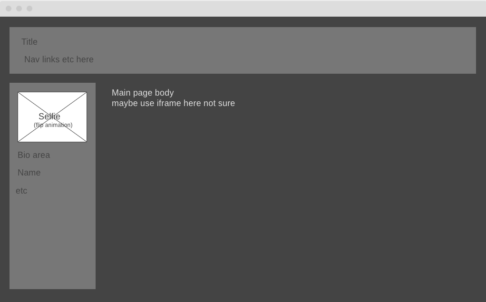

# Frontend Project

**Summary**
| Field | Detail |
|-------|--------|
| Project Name | Personal Site Showcase|
| Description | This site will be an example of several technologies I am familiar with. |
| Developers | Rich Clarke |
| Live Website | https://aretecore.github.io |
| Repo | https://www.github.com/aretecore/frontend-project/ |

## Problem Being Solved and Target Market

Problem: My personal site is not very robust. Time to change that. This will be a good example of basic skills I can show to potential employers. 

On the main page, there will be a quote of the day displayed above the nav bar at the top of the screen, using the https://quotes.rest/ API.

In sub sections there will be some work with other APIs, namely one I did with the NASA API and the project for the weather API with the bonus completed.

## Technologies Used
- HTML
- CSS
- JavaScript
- jQuery
- AJAX
## User Stories

List of stories users can experience on my site.

- Users should be able to see the site on desktop and mobile
- Users can read a basic bio
- Users can see my work with HTML and CSS
- Users can see my work in javascript and jQuery
- Users can see my use of various API calls
- Users can see my YouTube presence

## User Interface Mockups

